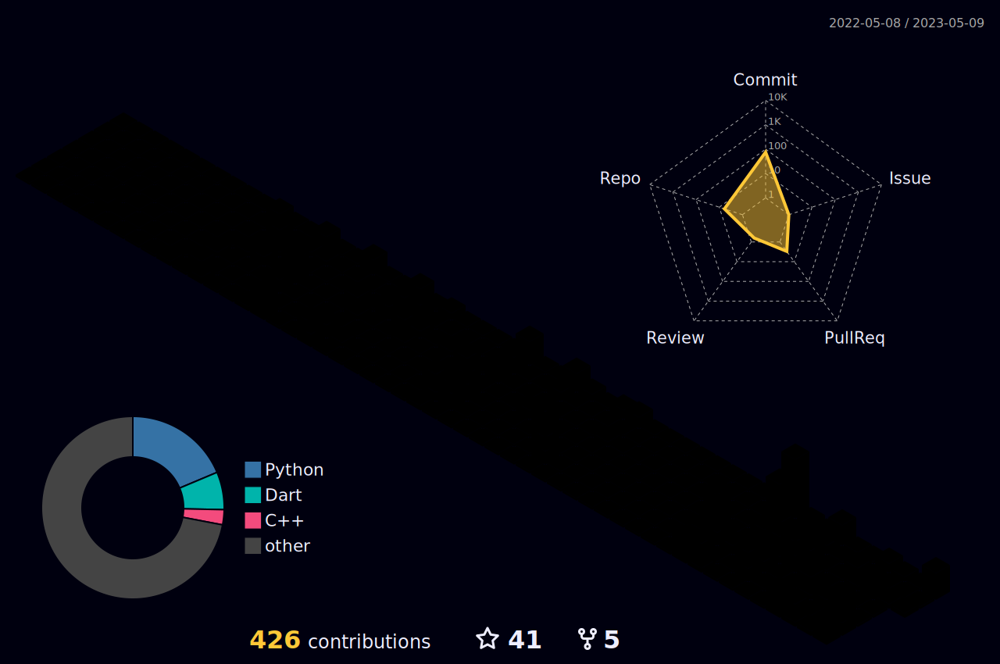

 
 

### Here are some fun facts about me:

- 💻 I enjoy solving complex problems and fixing technical issues.
- 🚀 I’m currently working at TaxiTR as a Backend Developer.
- 👥 I’m looking to collaborate with people with Amazing Ideas.
   

## 📩 Connect with me

 
 
 

#

#

 
 

  

  
  
  

#

**𝙻𝙰𝙽𝙶𝚄𝙰𝙶𝙴𝚂 𝙰𝙽𝙳 𝚃𝙾𝙾𝙻𝚂:**

 

 

 

<code></code>
<code></code>
<code></code>
<code></code>
<code></code>
<code></code>
<code></code>

#

 

#

 

#

**GITHUB STATS :**

    
    

